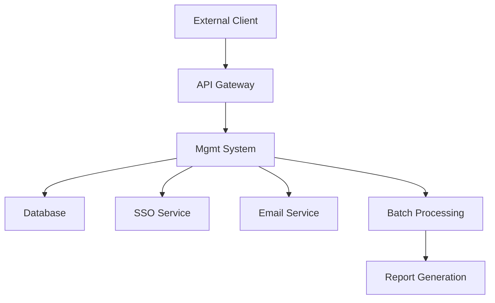

# TPS CRS Management System

## 📋 Table of Contents

- [System Overview](#system-overview)
- [CRS and RRA System Architecture](#crs-and-rra-system-architecture)
- [Prerequisites](#prerequisites)
- [Installation & Setup](#installation--setup)
- [Database Configuration](#database-configuration)
- [Account Management](#account-management)
- [SSO Integration](#sso-integration)
- [User Sub ID Query](#user-sub-id-query)
- [Database Tables](#database-tables)
- [Development Guidelines](#development-guidelines)
- [API Documentation](#api-documentation)
- [Troubleshooting](#troubleshooting)

## 🌟 System Overview

The **TPS CRS Management System** is a comprehensive Spring Boot-based backend application that manages customer reward systems and regional reward alliances for Taiwan Mobile (TWM).

### Key Features

- 🔐 Single Sign-On (SSO) authentication with NT SSO integration
- 👥 User account and role management
- 🎯 Serial campaign management
- 📊 Reporting and analytics
- 🔄 MoMo ID change system
- 📧 Email notification system
- ⏰ Scheduled task management

## 🏗️ CRS and RRA System Architecture

### CRS (Coin Reward System)

The CRS system generates reward coins (momo coins) for TWM customers through the following components:

| Component   | Description                             |
| ----------- | --------------------------------------- |
| **Mogw**    | API Gateway for external communications |
| **Batch**   | Reward list generator                   |
| **Mors**    | Reward amount generator                 |
| **Content** | SMS message generator                   |
| **Util**    | Reward amount validator                 |
| **Mgmt**    | Business web server (this application)  |

### RRA (Regional Reward Alliance) / WanderJoy

RRA will clone the Mgmt system from CRS with these components:

| Component   | Description                                  |
| ----------- | -------------------------------------------- |
| **Torp**    | API Gateway                                  |
| **Product** | Backend server for reward/product management |

### System Integration Flow



## 🔧 Prerequisites

### Software Requirements

- **Java 11** or higher
- **Maven 3.6+**
- **Oracle Database 11g** or higher
- **IDE** (IntelliJ IDEA or Eclipse recommended)

### Environment Setup

1. Install Java 11 JDK
2. Install Maven
3. Configure Oracle Database connection
4. Set up SSL certificates (if required)

## 🚀 Installation & Setup

### 1. Clone and Build

```bash
# Clone the repository
git clone <repository-url>
cd tps-crs-mgmt

# Build the project
mvn clean install

# Skip tests during build (if needed)
mvn clean install -DskipTests
```

### 2. Environment Configuration

Copy and configure the appropriate properties file:

```bash
# For development
cp src/main/resources/application-dev.properties.template src/main/resources/application-dev.properties

# For UAT
cp src/main/resources/application-uat.properties.template src/main/resources/application-uat.properties

# For production
cp src/main/resources/application-prod.properties.template src/main/resources/application-prod.properties
```

### 3. Run the Application

```bash
# Development mode
mvn spring-boot:run -Dspring.profiles.active=dev

# Or with specific profile
java -jar target/crs-mgmt-0.0.1-SNAPSHOT.jar --spring.profiles.active=dev
```

### 4. Access the Application

- **Local Development**: http://localhost:8080
- **Development Environment**: https://web.crsdev.taiwanmobile.com

## 🗄️ Database Configuration

### Oracle Database Setup

```properties
# Database Configuration (application-dev.properties)
spring.modb.jdbc-url=jdbc:oracle:thin:@//localhost:1521/xepdb1
spring.modb.username=momoapi
spring.modb.password=12345678
spring.modb.max-active=5
spring.modb.initial-size=3
spring.modb.min-idle=3
```

### Key Database Schemas

- **Account Schema**: User and role management
- **Campaign Schema**: Reward campaign data
- **Report Schema**: Analytics and reporting data

## 👤 Account Management

### Mgmt Account Development and Management

#### Key Features

- Internal TWM user accounts (NT account holders)
- Account lifecycle management (minimum 3 months activity)
- Role-based access control
- Permission management
- Account approval workflow

#### Account Requirements

- **Internal TWM Users**: Must have NT domain accounts
- **Account Status**: Active for minimum 3 months
- **Inactive Accounts**: Automatically disabled with email notifications
- **Permissions**: Role-based menu and function access

#### Account Creation Process

1. Verify NT domain account
2. Assign department and role
3. Configure permissions
4. Send activation email
5. Monitor account activity

## 🔐 SSO Integration

### Authentication Flow

The system integrates with Taiwan Mobile's NT SSO service for secure authentication.

#### SSO Configuration

```properties
# NT SSO Configuration
nt.sso.url=https://ssouat.taiwanmobile.com/SSOUAT/SSOAPI.aspx
nt.sso.sid=200348
nt.sso.auth.type=Form
```

#### Authentication Process

1. **Initial Request**: User accesses `/sso/login`
2. **SSO Redirect**: Redirect to NT SSO service
3. **Token Exchange**: Receive token from SSO service
4. **User Validation**: Validate token and retrieve user info
5. **Session Creation**: Create application session
6. **Access Control**: Enforce role-based permissions

### Session Management

- **Session Timeout**: 120 minutes
- **Session Storage**: Server-side session management
- **Session Validation**: Real-time session checking via interceptors

## 🔍 User Sub ID Query

### Purpose

User Sub ID queries are essential for the RRA (Regional Reward Alliance) project to identify TWM customers using user tokens.

#### Query Process

1. **Token Reception**: Receive user token from client
2. **Token Validation**: Validate token authenticity
3. **Sub ID Lookup**: Query customer Sub ID from database
4. **Response**: Return Sub ID for further processing

#### Implementation Example

```java
@RestController
public class SubIdQueryController {

    @PostMapping("/api/subid/query")
    public ResponseEntity<SubIdResponse> querySubId(@RequestBody TokenRequest request) {
        // Validate token
        // Query Sub ID from database
        // Return Sub ID response
    }
}
```

### UI Development

A simple UI will be developed for Sub ID user searches:

- **Search Input**: User token or identifier
- **Search Results**: Display user Sub ID and basic info
- **Error Handling**: Clear error messages for invalid queries

## 📊 Database Tables

### Core Tables

#### Account Management Tables

| Table Name                   | Description                     |
| ---------------------------- | ------------------------------- |
| `ACCOUNT`                    | User account information        |
| `ACCOUNT_ACTION_HISTORY`     | Account modification history    |
| `ACCOUNT_APPROVAL_SETTING`   | Account approval workflow       |
| `ACCOUNT_PERMISSION_PROGRAM` | User-specific permissions       |
| `DEPARTMENT`                 | Organizational departments      |
| `ROLE`                       | User roles and responsibilities |
| `ROLE_PERMISSION_PROGRAM`    | Role-based permissions          |
| `MENU`                       | System menu structure           |
| `PROGRAM`                    | System programs and functions   |
| `LOGIN_HISTORY`              | User login tracking             |

#### AP (Application Program) Tables

| Table Name               | Description                |
| ------------------------ | -------------------------- |
| `AP_ACCOUNT`             | AP account management      |
| `AP_ACCOUNT_MAP_ACCOUNT` | AP to user account mapping |
| `AP_KEY_IV`              | Encryption keys and IVs    |
| `AP_KEY_TABLE`           | Key management table       |

#### Campaign Management Tables

| Table Name                      | Description               |
| ------------------------------- | ------------------------- |
| `CAMPAIGN_MAIN`                 | Main campaign information |
| `SERIAL_CAMPAIGN_DETAIL`        | Campaign details          |
| `SERIAL_CAMPAIGN_FILE`          | Campaign file attachments |
| `SERIAL_APPROVAL_BATCH`         | Approval batch processing |
| `SERIAL_APPROVAL_DETAIL`        | Approval details          |
| `SERIAL_APPROVAL_BATCH_HISTORY` | Approval history          |

#### Reporting Tables

| Table Name                         | Description          |
| ---------------------------------- | -------------------- |
| `SERIAL_REWARD_REPORT`             | Reward reports       |
| `SERIAL_REWARD_REPORT_DETAIL`      | Detailed reward data |
| `SERIAL_DATA`                      | Serial number data   |
| `SERIAL_TRANSACTION_OFFER_HISTORY` | Transaction history  |

#### MoMo Integration Tables

| Table Name                         | Description           |
| ---------------------------------- | --------------------- |
| `SERIAL_MOMO_CREATE_BATCH`         | MoMo batch creation   |
| `SERIAL_MOMO_CREATE_DETAIL`        | MoMo creation details |
| `SERIAL_MOMO_CREATE_BATCH_HISTORY` | MoMo batch history    |

### Database Relationships

- **Account → Role → Permission**: Role-based access control
- **Campaign → Detail → File**: Campaign management hierarchy
- **Approval → Batch → Detail**: Approval workflow
- **Report → Detail → Data**: Reporting structure

## 💻 Development Guidelines

### Adding New Features

1. **Menu Integration**: Add new menu items to system navigation
2. **Permission Control**: Implement role-based access
3. **Database Changes**: Follow naming conventions
4. **Testing**: Include unit and integration tests
5. **Documentation**: Update API documentation

### Code Structure

```
src/main/java/com/twm/mgmt/
├── controller/          # REST controllers
├── service/            # Business logic
├── persistence/        # Data access layer
│   ├── entity/        # JPA entities
│   ├── repository/    # Data repositories
│   └── dto/           # Data transfer objects
├── config/            # Configuration classes
├── utils/             # Utility classes
├── enums/             # Enum definitions
└── validator/         # Input validation
```

### Best Practices

- Follow Spring Boot conventions
- Use Lombok for boilerplate code reduction
- Implement proper error handling
- Add comprehensive logging
- Follow security best practices

## 📡 API Documentation

### Authentication Endpoints

- `GET /sso/login` - SSO login initiation
- `GET /sso/callback` - SSO callback handler
- `POST /session/validate` - Session validation

### Account Management Endpoints

- `GET /api/accounts` - List accounts
- `POST /api/accounts` - Create account
- `PUT /api/accounts/{id}` - Update account
- `DELETE /api/accounts/{id}` - Delete account

### Sub ID Query Endpoints

- `POST /api/subid/query` - Query user Sub ID
- `GET /api/subid/search` - Search Sub ID by criteria

### Campaign Management Endpoints

- `GET /api/campaigns` - List campaigns
- `POST /api/campaigns` - Create campaign
- `PUT /api/campaigns/{id}` - Update campaign

## 🔧 Configuration

### Application Profiles

- **dev**: Development environment
- **uat**: User Acceptance Testing
- **prod**: Production environment

### Key Configuration Files

- `application-{profile}.properties` - Environment-specific settings
- `logback-spring.xml` - Logging configuration
- `ESAPI.properties` - Security configuration

### Security Configuration

```properties
# Encryption Settings
ap.account.secrect.key=oJ9YTPTOEmDK1vhbXPEFRffeIRVhPi4a
ap.account.secrect.iv=u2L0KebuHPcjSKeg

# Jasypt Encryption
jasypt.encryptor.algorithm=PBEWithMD5AndDES
```

## 🐛 Troubleshooting

### Common Issues

#### Database Connection Issues

```bash
# Check database connectivity
telnet <db-host> <db-port>

# Verify JDBC URL format
jdbc:oracle:thin:@//hostname:port/service_name
```

#### SSO Authentication Problems

1. Verify SSO URL configuration
2. Check certificate validity
3. Validate SID and auth type
4. Review firewall settings

#### Session Management Issues

1. Check session timeout settings
2. Verify cookie configuration
3. Review interceptor logic
4. Monitor session storage

### Log Analysis

```bash
# View application logs
tail -f logs/application.log

# Check access logs
tail -f logs/access_log.yyyy-MM-dd.log

# Monitor error logs
grep ERROR logs/application.log
```

## 📞 Support

### Development Team Contact

- **Email**: crs@taiwanmobile.com
- **Environment**: Development/UAT/Production
- **Monitoring**: Application health checks available at `/actuator/health`

### External Dependencies

- **NT SSO Service**: https://ssouat.taiwanmobile.com
- **Database**: Oracle Database
- **Mail Server**: Internal SMTP relay

---

## 📝 License

This project is proprietary software of Taiwan Mobile Co., Ltd.

## 🔄 Version History

- **v0.0.1-SNAPSHOT**: Initial development version
- **Spring Boot**: 2.7.8
- **Java**: 11

---

_Last Updated: 2024_
